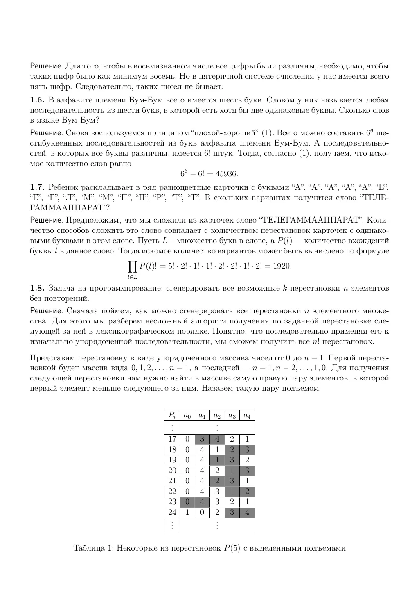
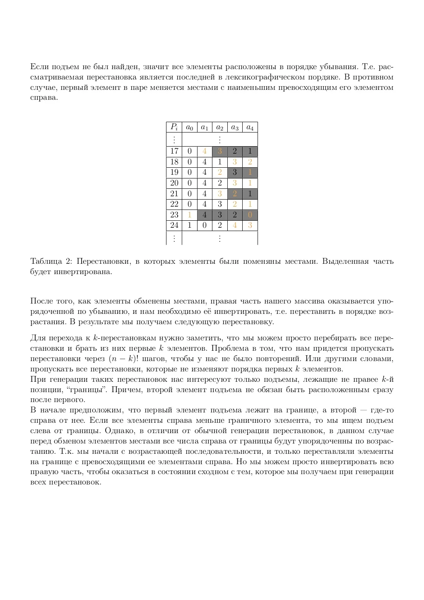
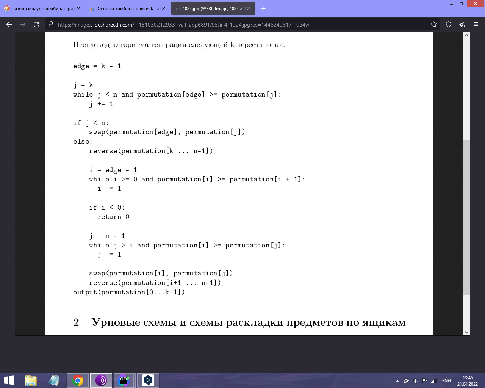

## K-перестановки из n элементов
Нужно сгенерировать все возможные k-перестановки n-элементов без повторений.

## Формат входные данные:
Два числа `n` и `k` через пробел. Для них гарантированно выполняется условие: `0 < k ≤ n`.

## Формат выходных данных:
Необходимое число лексикографически упорядоченных строк, в каждой из которых содержится `k` чисел от `0` до `n - 1`, разделенных пробелом.

## Sample Input:
```
4 2
```
## Sample Output:
```
0 1
0 2
0 3
1 0
1 2
1 3
2 0
2 1
2 3
3 0
3 1
3 2
```


