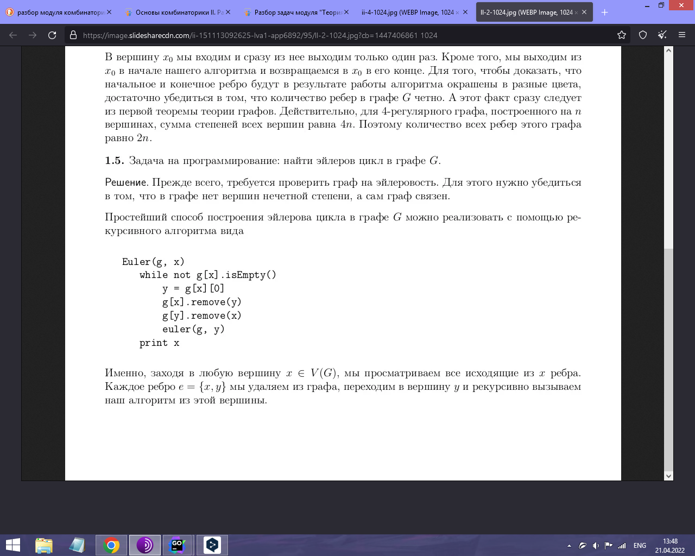

# Эйлеровы графы

Найдите эйлеров цикл в графе.

## Формат входных данных:
В первой строке указаны два числа разделенных пробелом: vv (число вершин) и ee (число ребер). В следующих ee строках указаны пары вершин, соединенных ребром. Выполняются ограничения: 2\leq v \leq1000,0\leq e\leq10002≤v≤1000,0≤e≤1000 .

## Формат выходных данных:
Одно слово: NONE, если в графе нет эйлерова цикла, или список вершин в порядке обхода эйлерова цикла, если он есть.

## Sample Input 1:

4 2
1 2
3 2
## Sample Output 1:

NONE
Sample Input 2:

3 3
1 2
2 3
3 1
Sample Output 2:

1 2 3

