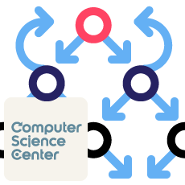
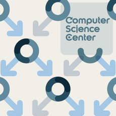

## Instructors
[Александр Куликов](https://alexanderskulikov.github.io/)

[Павел Маврин](https://compscicenter.ru/teachers/856/)

[Сергей Лебедев](https://compscicenter.ru/teachers/480/)

[Алексей Левин](https://stepik.org/users/1322160)

# Алгоритмы: теория и практика.
### [Методы](https://stepik.org/course/217/info)

Алгоритмы — важнейший раздел computer science и программирования. Благодаря развитию информационных технологий и алгоритмам мы сегодня имеем возможность быстро находить информацию в интернете (в частности, искать по картинкам), находить кратчайшие пути, анализировать геномы и так далее. Алгоритмы используются практически во всех областях computer science — в анализе изображений, в интернет-поиске, в машинном обучении, в биоинформатике, в криптографии, в кодировании, в сетях, в распределённых системах, в компиляторах.

В курсе будут подробно разобраны базовые алгоритмические методы: жадные алгоритмы, метод «разделяй и властвуй», динамическое программирование. Для всех алгоритмов будут математически строго доказаны корректность и оценки на время работы. Мы постарались изложить материал так, чтобы были понятны и сами алгоритмы, и то, как можно было бы догадаться до их основных идей. Помимо теоретических основ, будут рассказаны тонкости реализации алгоритмов на языках программирования C++, Java и Python. В частности, будет рассказано, какие есть общие практики написания кода, позволяющие минимизировать вероятность ошибки, как писать и тестировать код, где стоит использовать стандартные методы, а не изобретать колесо.

### [Структуры данных](https://stepik.org/course/1547/info)

В курсе будут рассмотрены структуры данных, наиболее часто использующиеся на практике: массивы, списки, очереди, стеки, динамические массивы, очереди с приоритетами, системы непересекающихся множеств, хеш-таблицы, сбалансированные деревья. Вы узнаете, как такие структуры данных реализованы в разных языках программирования, и, конечно же, потренируетесь самостоятельно их реализовывать, применять и расширять.

Основная цель курса — узнать, как устроены основные структуры данных (чтобы не пользоваться их готовыми реализациями как чёрным ящиком, а точно знать, чего от реализации ожидать), и научиться выбирать подходящую структуру данных при решении заданной вычислительной задачи.