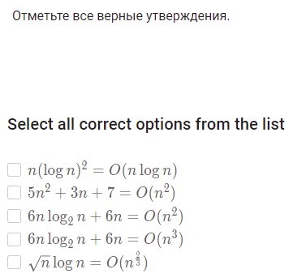
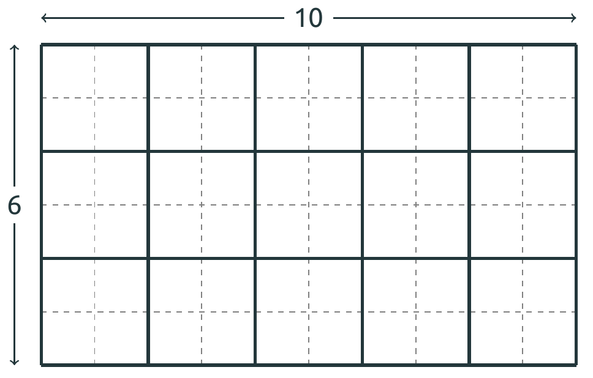

# Task 2
Напишите программу, которая получает на вход два числа 1 ≤ n,m ≤ 2 * 10^9
и находит минимальное число квадратов одинакового размера, на которое можно разрезать прямоугольник размера n × m. Например, прямоугольник размера 6 × 10 можно разбить на 15 квадратов (и на меньшее число нельзя).

Sample Input 1:

10 6
Sample Output 1:

15
Sample Input 2:

2 3
Sample Output 2:

6

# Task 3
Напишите программу, которая получает на вход два числа 1≤n,m≤10^18
и находит последнюю цифру наибольшего общего делителя чисел Фибоначчи F_n и F_m 
(то есть gcd(Fn, Fm) mod10).

Sample Input 1:

6 9
Sample Output 1:

2
Sample Input 2:

7 14
Sample Output 2:

3
Sample Input 3:

34 51
Sample Output 3:

7